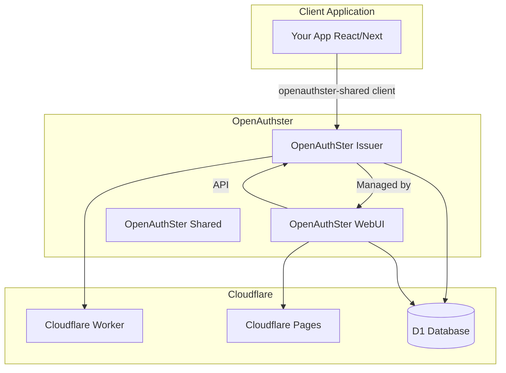

# OpenAuthSter WebUI — Agent Guide

This file provides context for AI agents working on the OpenAuthSter WebUI project, especially for the landing page SaaS evolution (free and paid tiers).

---

## 1. Project Context

**OpenAuthSter WebUI** is the management dashboard for the [OpenAuthster](https://github.com/shpaw415/openauthster) multi-tenant authentication system. It is the administrative interface that configures projects, providers, themes, and templates.

### Related Repositories

| Repository | Description |
|------------|-------------|
| [openauthster](https://github.com/shpaw415/openauthster) | Main project overview |
| [OpenAuthSter-issuer](https://github.com/shpaw415/OpenAuthSter-issuer) | Authentication server (Cloudflare Worker) |
| **OpenAuthSter-webUI** (this repo) | Management dashboard (Cloudflare Pages) |
| [OpenAuthSter-shared](https://github.com/shpaw415/OpenAuthSter-shared) | Client SDK, types, database schemas |
| [openauthster-doc](https://github.com/shpaw415/openauthster-doc) | Documentation site |

### Documentation

- [doc.openauthster.com](https://doc.openauthster.com/)
- [doc.openauthster.com/docs](https://doc.openauthster.com/docs)

---

## 2. Architecture

### Global Architecture



### This Repository: OpenAuthSter-webUI

**Role**: Administrative dashboard for managing authentication projects.

**Build output**: `.frame-master/build` (deployed to Cloudflare Pages)

### Directory Structure

```
src/
├── pages/              # File-based routing (Next.js-style)
│   ├── index.tsx       # Landing page (/)
│   ├── invite/
│   └── dashboard/      # Admin area (layout.tsx wraps all /dashboard/*)
├── actions/api/        # Server actions → Cloudflare Pages Functions
│   ├── _middleware.ts  # Auth on all /api/* routes
│   ├── dashboard/
│   ├── projects/
│   ├── providers/
│   ├── themes/
│   ├── templates/
│   ├── users/
│   ├── webhooks/
│   └── ...
├── hooks/              # React hooks (useAuth, useProjects, useDashboard, etc.)
├── components/
├── open-auth.ts        # OpenAuthster client config
├── cloudflare/index.ts # Cloudflare API (custom domains)
├── shell.tsx           # HTML shell for SSR
└── client-wrapper.tsx  # Client hydration + AuthProvider
```

### Frame Master Build System

The `frame-master.config.ts` configures:

| Plugin | Purpose |
|--------|---------|
| ReactToHtml | SSR with shell `src/shell.tsx`, pages from `src/pages/` |
| ApplyReact | Client hydration, Next.js-style routing |
| TailwindPlugin | `static/tailwind.css` → `static/style.css` |
| CloudflareAction | `src/actions/` → Pages Functions + type-safe client wrappers |
| EnvInHtml | Inject `PUBLIC_*` and `NODE_ENV` into HTML |
| mdxLoaderPlugin | MDX with Shiki, remark-gfm, rehype-pretty-code |
| ImageOptimizerPlugin | WebP optimization, multiple sizes |
| svgToJsxPlugin | Import SVGs as React components |

### Actions (Type-Safe API)

The plugin `frame-master-plugin-cloudflare-pages-functions-action`:

- **File → route**: `src/actions/api/projects/index.ts` → `/api/projects`
- **HTTP methods**: Exported `GET`, `POST`, `PUT`, `DELETE` become handlers
- **Client**: `import { GET as getProjects } from "@api/projects"` → wrapper that `fetch()`es with header `x-server-action: true`
- **Serialization**: superjson for params and responses
- **Server context**: `getContext(arguments)` provides `env`, `request`, `data` (with `data.client` = auth client from middleware)
- **Bypass**: `"no action";` at top of file (e.g. `_middleware.ts`) skips transformation

---

## 3. Stack and Dependencies

| Layer | Technology |
|-------|------------|
| Runtime | Bun.js |
| Build | Frame Master 3.x |
| UI | React 19, Tailwind CSS 4 |
| Hosting | Cloudflare Pages |
| Database | D1 (shared with Issuer via `PROJECT_DB`) |
| Types/SDK | openauth-webui-shared-types (from OpenAuthSter-shared) |

Key deps: `@iconify/react`, `recharts`, `drizzle-orm`, `valibot`, `@monaco-editor/react`, `@material/react-snackbar`.

---

## 4. Authentication

- **Client**: `src/open-auth.ts` creates OpenAuthster client (issuer, redirect, `clientID: openauth_webui`)
- **Provider**: `AuthProvider` in `client-wrapper.tsx` calls `client.init()` and exposes `useAuth()`
- **Private session**: `group_ids` — determines which projects the user can access (owner_id or owner_group_id)
- **API middleware**: `src/actions/api/_middleware.ts` — in prod, validates token via `createClient().setTokenFromRequest()`, injects `data.client`; in dev (localhost), mocks an admin

---

## 5. Entities and API

| Entity | Description |
|--------|-------------|
| **Projects** | Multi-tenant; each has providers, themes, users |
| **Providers** | OAuth (Google, GitHub, etc.), email/password, OIDC, passkey |
| **Templates** | Email templates, copy (i18n) |
| **Themes** | UI customization for auth pages |
| **Webhooks** | Event notifications |
| **Logs** | Activity and error logs |

API routes: `/api/dashboard`, `/api/projects`, `/api/projects/manage`, `/api/providers`, `/api/themes`, `/api/templates`, `/api/users`, `/api/webhooks`, `/api/logs`, `/api/invitelink`, `/api/invites/*`.

---

## 6. Development Commands

```bash
bun install                    # Install dependencies
bun dev                        # Start dev server (port 3001)
bun build                      # Production build
bun build:dev                  # Development build
bun run init:db                # Apply D1 migrations
bun run db:generate            # Generate D1 migrations
bun run db:migrate             # Run migrations
bun run update:share           # Update openauth-webui-shared-types
bun run dev:deploy             # Build + wrangler pages deploy
```

---

## 7. Conventions

### Path Aliases (tsconfig.json)

| Alias | Path |
|-------|------|
| `@api/*` | `./src/actions/api/*` |
| `@hooks/*` | `./src/hooks/*` |
| `@docs/*` | `./src/docs/*` |
| `@components/*` | `./src/components/*` |
| `@auth` | `./src/open-auth.ts` |
| `@static/*` | `./static/*` |
| `@utils` | `./src/utils.ts` |

### Patterns

- Hooks fetch data via action imports: `const projects = await getProjects();`
- Pages use `useAuth()` for login state and `auth.login()` / `auth.logout()`
- Dashboard pages are wrapped by `dashboard/layout.tsx` which enforces auth

---

## 8. Environment Variables

| Variable | Required | Description |
|----------|----------|-------------|
| `PUBLIC_ISSUER` | Yes | OpenAuthster issuer URL |
| `PUBLIC_REDIRECT_URI` | Yes | WebUI callback URL (must end with `/`) |
| `PUBLIC_CLIENT_ID` | Yes | WebUI client ID (use `openauth_webui`) |
| `CLOUDFLARE_API_TOKEN` | Yes | API token for Workers management |
| `CLOUDFLARE_ACCOUNT_ID` | Yes | Cloudflare account ID |
| `CLOUDFLARE_AUTH_DOMAIN_ZONE_ID` | Yes | Zone ID for auth domain |
| `CLOUDFLARE_WORKER_SERVICE_NAME` | Yes | Issuer Worker name |
| `CLOUDFLARE_AUTH_ENDPOINT_DOMAIN` | No | Custom auth endpoint domain |
| `BUN_VERSION` | Yes | `1.3.4` (do not change) |
| `SKIP_DEPENDENCY_INSTALL` | Yes | `true` (do not change) |

---

## 9. Landing Page

### 9.1 Current State

**File**: `src/pages/index.tsx`

- Brutalist design (background #09090b, grid, zinc/sky colors)
- Hero, 4 features (Multi-Tenant, Secure, Cloudflare-Native, Extensible)
- Tech stack badges (Workers, Hono, React, Tailwind, Drizzle)
- Buttons: Access / Deploy Instance (depending on auth)
- Known issue: GitHub link uses `openauthster/openauthster` — should be `shpaw415/openauthster`

### 9.2 Target Design (Landing Page Style)

The landing page redesign should follow a **futuristic, modern, minimalist** aesthetic with **smooth animations and transitions**. Reference: dark SaaS landing (AIVERA-style) with glassmorphism and electric blue accents.

#### Color Palette

| Role | Value | Usage |
|------|-------|-------|
| Background | #000000 to #0a0a0a | Deep black to charcoal |
| Accent | #007AFF | Buttons, glow effects, highlights |
| Headings | White | Primary text |
| Descriptions | Light gray | Secondary text |

#### Atmosphere

- **Glassmorphism**: Semi-transparent backgrounds with `backdrop-filter: blur`
- **Glow effects**: Soft blue radial gradients behind key elements (buttons, featured cards)
- **Tone**: Discrete "neon/cyber" look without overloading

#### Page Structure

- **Hero**: Centered headline, sub-headline, 2 CTAs (solid primary + ghost), app mockup
- **Social proof**: Partner logos in grayscale, horizontal row
- **Feature grid**: Cards with subtle borders, rounded corners; one highlighted card with glow
- **Pricing**: Monthly/Yearly toggle, 3 cards (Free, Pro, Team); Pro card with "Popular" badge and glow
- **Testimonials**: Card-based carousel, active card with soft glow
- **Footer**: Column-based navigation links, ghost logo in background

#### UI Components

- **Buttons**: Pill-shaped (highly rounded), subtle gradients, small icons (arrow, sparkle)
- **Icons**: Thin-line, minimalist
- **Borders**: Subtle, rounded corners on cards and containers

#### Animations and Transitions

- **Scroll reveals**: Fade in + slight slide up as user scrolls
- **Hover states**: Glow expansion, slight scale (1.05x) on pricing/feature cards
- **Background**: Slow-moving radial gradients for a "living" feel
- **Micro-interactions**: Smooth transitions on Monthly/Yearly toggle
- **Loading**: Shimmer/skeleton screens matching dark/blue theme
- **Duration**: 200–400ms with natural easing (ease-out, ease-in-out)

#### Principles

- Futuristic, modern, minimalist
- Smooth animations — avoid jarring or abrupt changes
- Favor negative space; avoid visual clutter

#### Density and Liveliness Directives

- **Section spacing**: Prefer tighter section rhythm for the landing (`py-14` to `py-16`) instead of oversized gaps.
- **Information density**: Add useful intermediate UI blocks (trust stats, compact chips, mini cards) to avoid empty areas.
- **Living components**: Keep a visible logos strip (`Iconify`), trust stats, and a highlighted CTA glow treatment.
- **Icon system**: Use Iconify consistently (`simple-icons`, `lucide`, `logos`) for feature cues, social proof, pricing bullets, and footer links.
- **Animation rules**:
  - Keep interactions in the 200–400ms range.
  - Ambient background motion can run slower (6–20s loops).
  - Use subtle effects only (`float`, `marquee`, `shimmer`, `pulse-ring`) and avoid aggressive movement.
- **Performance safety**: Animate opacity/transform where possible, avoid heavy layout-shifting animations.

---

## 10. SaaS Objective

**Current model**: Self-hosted — user deploys Issuer + WebUI on their own Cloudflare.

**Target model**: SaaS with:

- **Free tier** — limited (e.g. 1 project, 100 users)
- **Paid tier** — higher limits and advanced features

The landing page must reflect this model, explain offers, and direct users to sign up or start with the free tier. When evolving the landing, keep this context in mind for CTAs, pricing sections, and feature comparison. **The landing must follow the design system defined in section 9.2.**
